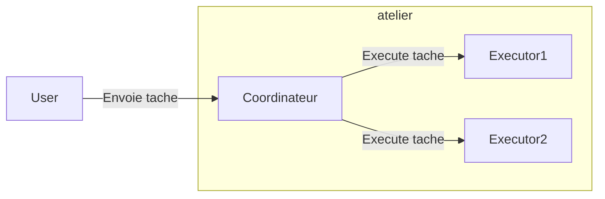

# Formation Golang

### Orgnisation des ateliers

Une version anglaise est [disponible](README_en.md).

Il faut réaliser 7 ateliers se trouvant chacun dans un répertoire.
Chaque atelier répertoire contient la correction du précédent atelier.

* [Atelier 1](atelier1/README.md)
* [Atelier 2](atelier2.0/README.md) : cet atelier se fait en deux parties. La seconde est [2.1](atelier2.1/README.md) 
* [Atelier 3](atelier3/README.md)
* [Atelier 4](atelier4/README.md)
* [Atelier 5](atelier5.0/README.md)
* [Atelier 6](atelier6/README.md)
* [Atelier 7](atelier7/README.md)

### Projet

L'objectif de projet est d'exécuter des tâches diverses par le biais d'un serveur qui va distribuer ces tâches.
La distribution des tâches sera assez basique (round robin)

Les tâches : 
* Redimensionner une image
* Afficher un hello world avec le prénom de l'utilisateur
* Tâche fictive qui met un temps aléatoire à s'exécuter

