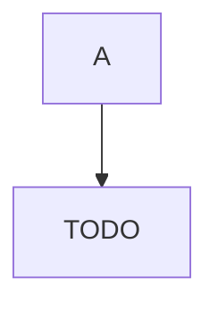

# Formation Golang

7 ateliers à réaliser

* [Atelier 1](atelier1/atelier1.md)
* [Atelier 2](atelier2.0/atelier2.md)
* [Atelier 3](atelier3/atelier3.md)
* [Atelier 4](atelier4/atelier4.md)
* [Atelier 5](atelier5/atelier5.md)
* [Atelier 6](atelier6/atelier6.md)
* [Atelier 7](atelier7/atelier7.md)

Architucture du projet

