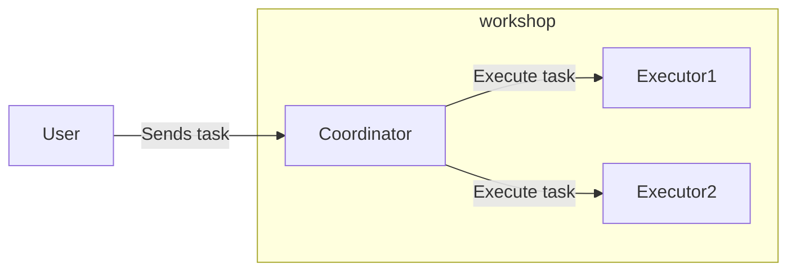

# Golang Training

### Organization of workshops

You must carry out 7 workshops, each located in a directory.
Every workshop directory contains the solution to the previous one.

* [Workshop 1](atelier1/README_en.md)
* [Workshop 2](atelier2.0/README_en.md) : this workshop is done in two parts. The second one is [2.1](atelier2.1/README.md)
* [Workshop 3](atelier3/README_en.md)
* [Workshop 4](atelier4/README_en.md)
* [Workshop 5](atelier5.0/README_en.md)
* [Workshop 6](atelier6/README_en.md)
* [Workshop 7](atelier7/README_en.md)

### Project

The purpose of this project is to execute different tasks through a server that will distribute them.
The distribution of the tasks is pretty basic (round robin).

The tasks :
* Resizing an image
* Dsiplay a hello world with the name of the user
* Fake task that takes a random amount of time to execute

