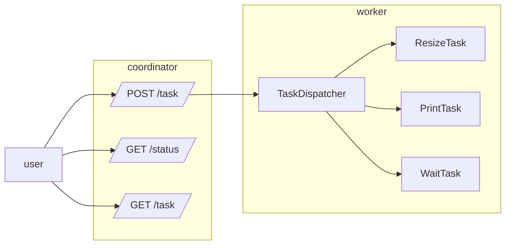

# Atelier 5
### Créer une API REST

#### Objectifs

* Savoir créer et appeler des API Rest avec l'API standard (atelier 5.0)
* Savoir utiliser la librairie Gin Gonic pour simplifier le développement d'API Rest (Atelier 5.1)

#### Etapes

Nous allons écrire deux APIS : 
* La première sera un coordinateur qui va seulement recevoir des tâches et les distribuer
* La seconde API sera un worker / unité de traitement qui exécutera les tâches

L'objectif est de pouvoir exécuter les tâches sur plusieurs worker afin de répartir facilement la charge.

##### Schéma

- **Premier pas**
  - Créer un serveur de base qui se lance sur le port 9007
  - Ajouter une route **/status** qui renvoie juste "up"
  - Modifier la fonction pour n'accepter que les requêtes GET, en revoyant une 405
- **Pour recevoir les demandes globales (coordinateur) **
  - Ajouter une route _POST_ **/task** pour pouvoir ajouter une tâche avec les champs : 
    - type : type de tâche (print ou resize)
    - les champs liés au type (message pour print par exemple)
    L'API renvoie une 201 si tout se passe bien, ainsi que l'id de la tâche, une erreur 400 sinon
  - Ajouter une route _GET_ **/tasks** pour lister les tâches : l'id, le type et l'état de la tâche
  - Ajouter une route _GET_ **/tasks/:id** pour avoir le détail d'une tâche : 
    - Attention, le task manager ne permet pas encore de retourner une tâche, à vous de l'ajouter :)

- Pour recevoir une tâche et la réaliser

#### Aide

* Pour créer un serveur en Go, [la page d'aide](https://pkg.go.dev/net/http)
* Pour convertir des données en json, vous pouvez utiliser la [bibliothèque json](https://pkg.go.dev/encoding/json)
  * [json.Marshall](https://pkg.go.dev/encoding/json#Marshal) pour sérialiser et [json.Unmarshall](https://pkg.go.dev/encoding/json#Unmarshal) pour désérialiser
  * Les "struct field's tag" permettent de personnaliser le nom des champs lors de la sérialisation
  * / ! \ Seuls les champs publiques sont sérialiser

#### Amélioration

L'implémentation du task manager utilise une liste : ce n'est pas efficace pour la suppression ou pour trouver une tâche.
Peut-être qu'une implémentation à base d'une map serait plus efficace