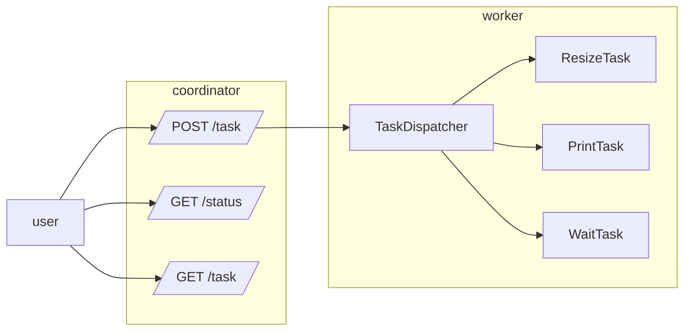

# Atelier 5
### Créer une API REST

**Branche Atelier 5.0**

#### Objectifs

* Savoir créer et appeler des API Rest avec l'API standard
* Savoir utiliser la librairie Gin Gonic pour simplifier le développement d'API Rest

#### Etapes

- **Premier pas**
  - Créer un serveur de base qui se lance sur le port 9001
  - Ajouter une route where /status qui renvoie juste "up"
  - Modifier la fonction pour n'accepter que les requêtes GET, en revoyant une 405
- Pour recevoir les demandes globales de traitements et le suivi des tâches
- Pour recevoir une tâche et la réaliser

#### Aide

* Pour créer un serveur en Go, [la page d'aide](https://pkg.go.dev/net/http)