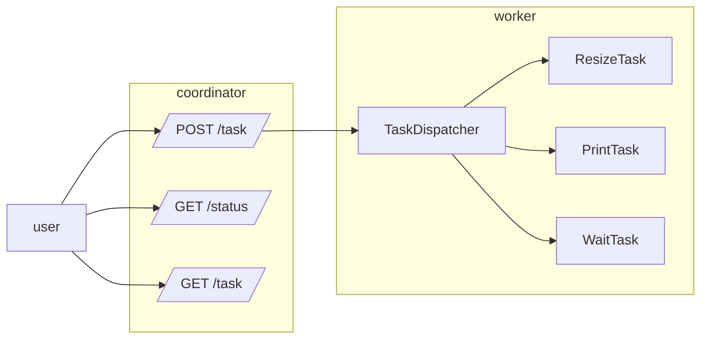

# Atelier 5
### Créer une API REST

#### Objectifs

* Savoir créer et appeler des API Rest avec l'API standard (atelier 5.0)
* Savoir utiliser la librairie Gin Gonic pour simplifier le développement d'API Rest (Atelier 5.1)

#### Etapes

Nous allons écrire deux APIS : 
* La première sera un coordinateur qui va seulement recevoir des tâches et les distribuer
* La seconde API sera un worker / unité de traitement qui exécutera les tâches

L'objectif est de pouvoir exécuter les tâches sur plusieurs worker afin de répartir facilement la charge.

##### Schéma

- **Premier pas**
  - Créer un serveur de base qui se lance sur le port 9007
  - Ajouter une route **/status** qui renvoie juste "up"
  - Modifier la fonction pour n'accepter que les requêtes GET, en revoyant une 405
- **Pour recevoir les demandes globales**
  - Ajouter une route _POST_ **/task** pour pouvoir ajouter une tâche
  - Ajouter une route _GET_ **/task** pour lister les tâches : le nom, le type et l'état de la tâche
  - Ajouter une route _GET_ **/task/:id** pour avoir le détail d'une tâche
- Pour recevoir une tâche et la réaliser

#### Aide

* Pour créer un serveur en Go, [la page d'aide](https://pkg.go.dev/net/http)