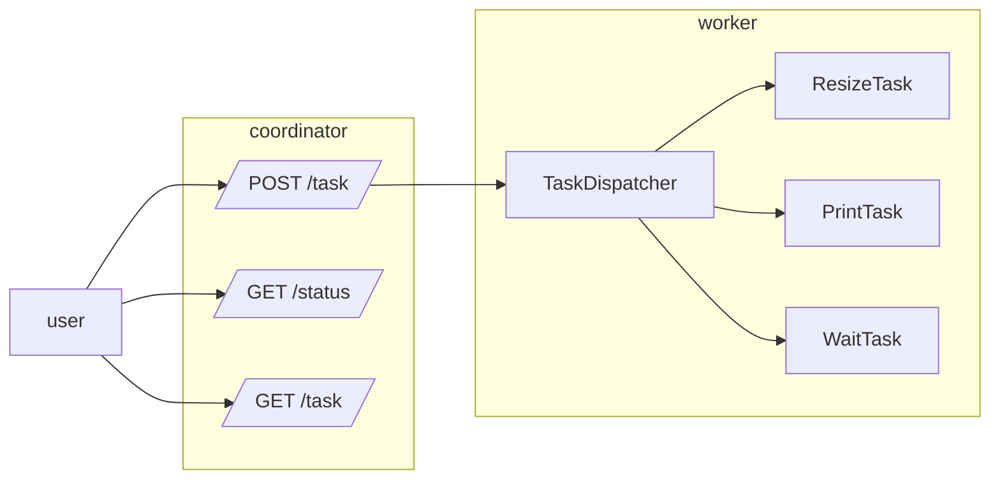

# Workshop 5
### Create a REST API

#### Objectives

* Know how to create and call Rest APIs with the standard API (workshop 5.0)
* Know how to use the Gin Gonic library to simplify the development of Rest API (Workshop 5.2)

#### Steps

We will write two APIs :
* The first will be a coordinator who will only receive tasks and distribute them
* The second API will be a worker / processing unit which will execute the tasks

The objective is to be able to execute tasks on several workers in order to easily distribute the load.

Communication between the coordinator and the worker(s) will take place in workshop 5.1

##### Diagram

- **First steps**
    - Create a basic server that launches on port 9007
    - Add a **/status** route that just returns "up"
    - Change the function to only accept GET requests, returning a 405

- **To receive global requests (coordinator)**
    - Add a _POST_ **/task** route to be able to add a task with the fields:
        - type : task type (print or resize)
        - fields linked to the type (message for print for example)
          The API returns a 201 if everything goes well, as well as the task id, a 400 error otherwise
    - Add a _GET_ **/tasks** route to list tasks: task id, type and status
    - Add a _GET_ **/tasks/:id** route to have the details of a task:
        - Please note, the task manager does not yet allow you to return a task, it's up to you to add it :)
    - Add a _POST_ **/tasks/:id** route to update the status of a task:
        - The status can be "error" or "finish"
        - Currently, the task manager does not know how to manage the status, it's up to you to find a solution :)

- **To receive a task and execute it (worker)**
    - Create a new server that launches on a port of your choice
    - Add a **/status** route that just returns "up"
    - Add a _POST_ **/task** route that executes the received task
        - When the task is completed, a _POST_ request is made to the coordinator: /tasks/:id with the status (error or finish)

- **Connect calls between coordinator and worker(s)**

#### Help

* To create a server in Go, check [the help page](https://pkg.go.dev/net/http)
* To convert data to json you can use [json library](https://pkg.go.dev/encoding/json)
    * [json.Marshall](https://pkg.go.dev/encoding/json#Marshal) to serialize and [json.Unmarshall](https://pkg.go.dev/encoding/json#Unmarshal) to deserialize
    * The "struct field's tag" allows you to customize the name of the fields during serialization
    * / ! \ Only public fields are serialized

#### Improvement

The task manager implementation uses a list: this is not efficient for deleting or finding a task.
Maybe a map-based implementation would be more efficient.