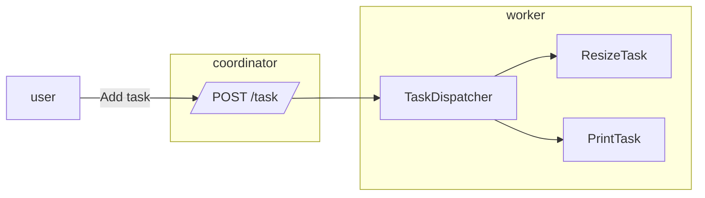

# Atelier 5
### Créer une API REST

**Branche Atelier 5**

#### Objectifs

* Savoir créer et appeler des API Rest avec l'API standard
* Savoir utiliser la librairie Gin Gonic pour simplifier le développement d'API Rest

#### Etapes

- Pour recevoir les demandes globales de traitements et le suivi des tâches
- Pour recevoir une tâche et la réaliser

#### Aide
